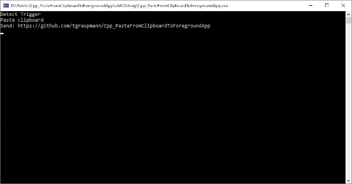

# PasteFromClipboardToForegroundApp

A C++ app to paste the clipboard into the foreground window

## Usage

Press the `left shift` and `right shift` keys at the same time to paste the text from the clipboard to the foreground window.

## Screenshots

### See Also

* [Cpp_PasteFromClipboardToForegroundApp](https://github.com/tgraupmann/Cpp_PasteFromClipboardToForegroundApp)

* [StayAwake](https://github.com/tgraupmann/StayAwake)
